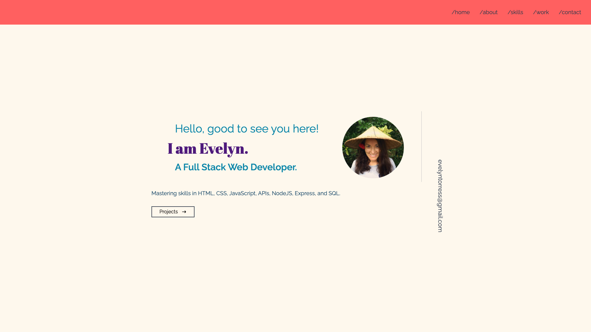
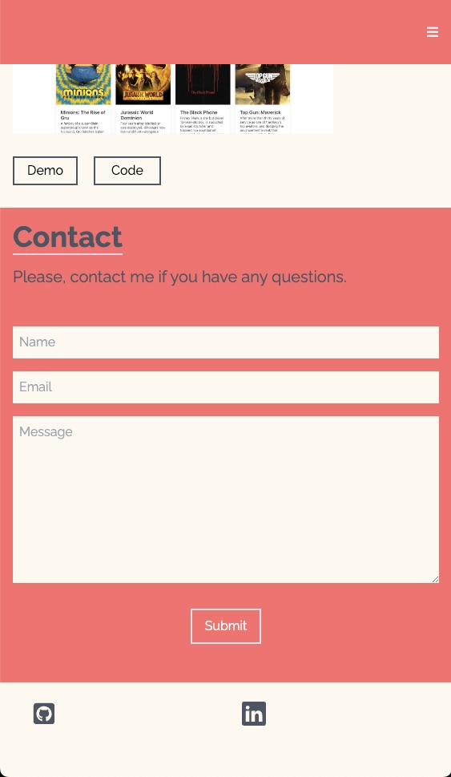

# 20 React: React Portfolio

## Description

My task is to create a portfolio using new React skills.
This is a simple portfolio, showing some of my skills and projects.
I used React and Tailwind as CSS framework. Also has a functional contact form.

## Installation
Clone the repo, run `npm install` and`npm start`.
Runs the app in the development mode.
Open [http://localhost:3000](http://localhost:3000) to view it in your browser.

## Mock-Up

The following images shows the web application's appearance and functionality:

Main web-page.

Mobile version.

## Usage

The site is live at Heroku [folow this link](https://calm-oasis-09257.herokuapp.com/)

